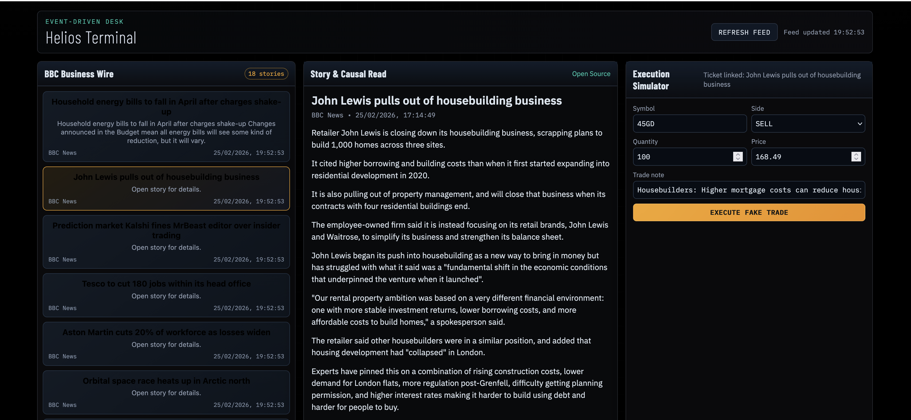

The goal is a **working MVP immediately on a single laptop, Java-only, zero budget.

---

# Project Codename

**Helios** – Event-Driven Causal Market Intelligence Engine

---

# 0. Product Definition (Codex must internalise this first)

**Input:**
A real-world market event (headline, macro release, policy decision)

**Output:**
A ranked, human-readable explanation of:

* Which assets / sectors are impacted
* Through which causal channels
* With confidence scores and uncertainty notes

**Explicit non-goals (Codex must NOT build these):**

* Real-time prices
* Charts
* Trading signals
* Forecasting returns
* UI polish

---

# 1. High-Level Architecture

Codex should implement **four layers**, strictly separated:

```
ingestion/
analysis/
knowledge/
presentation/
```

No cross-layer shortcuts.

---

# 2. Knowledge Layer (FOUNDATION – build first)

This is the moat. Everything else is plumbing.

## 2.1 Core domain model

Codex must implement these immutable domain objects:

```java
Entity {
  UUID id
  EntityType type  // COMPANY, SECTOR, COUNTRY, COMMODITY, POLICY_BODY
  String canonicalName
  Set<String> aliases
}

Event {
  UUID id
  EventType type   // MACRO, POLICY, EARNINGS, GEOPOLITICAL
  Instant timestamp
  String rawText
}

CausalLink {
  Entity source
  Entity target
  ImpactDirection direction // POSITIVE, NEGATIVE, MIXED
  double strength           // 0.0 – 1.0
  String rationale
}
```

Codex must store this as a **directed graph**.

---

## 2.2 Initial causal graph (hard-coded v1)

Codex should seed a **hand-written causal map**, e.g.:

* `Interest Rates ↑ → Banks (Net Interest Margin) ↑`
* `Interest Rates ↑ → Housebuilders ↓`
* `Oil ↑ → Airlines ↓`
* `Strong GBP → Exporters ↓`

This is *not* ML yet. Deterministic first.

Codex must place this in:

```
knowledge/causal_graph.json
```

---

# 3. Ingestion Layer

## 3.1 News ingestion (free only)

Codex tasks:

* Implement RSS ingestion
* Poll sources every N minutes
* Store raw text + timestamp

Approved sources:

* Central bank websites
* Government statistics offices
* Major news RSS feeds

Persistence:

* Local disk (JSONL or SQLite)
* No cloud, no Kafka, no queues

---

## 3.2 Economic calendar ingestion

Codex must:

* Scrape or parse public calendars
* Normalise events into `Event` objects

No need for surprise calculation yet.

---

# 4. Analysis Layer (CORE LOGIC)

## 4.1 Event classification

Codex must implement:

```java
EventClassifier {
  EventType classify(String rawText)
  Set<Entity> extractEntities(String rawText)
}
```

Rules-based v1:

* Keyword matching
* Alias lookup
* Regex

No LLM dependency.

---

## 4.2 Causal propagation engine

This is the **key algorithm**.

Given:

* An Event
* Extracted Entities

Codex must:

1. Locate entities in causal graph
2. Traverse outgoing edges (depth ≤ 2)
3. Accumulate impact scores
4. Rank impacted entities

Pseudo-logic Codex must implement:

```
impact(entity) =
  Σ (path_strength × edge_strength × confidence_decay)
```

Confidence decay:

* Depth 1: 1.0
* Depth 2: 0.6
* Depth >2: ignore

---

## 4.3 Output explanation synthesis

Codex must generate text like:

> “UK CPI came in above expectations.
> This increases the likelihood of higher interest rates.
> As a result:
>
> 1. UK retail banks may benefit from improved margins.
> 2. Housebuilders may face demand pressure due to mortgage costs.”

This **must be template-driven**, not generative.

---

# 5. Presentation Layer (INTENTIONALLY MINIMAL)

## 5.1 CLI interface (mandatory)

Codex must implement:

```bash
$ helios explain "UK CPI surprise"
```

Output:

* Event summary
* Ranked impact list
* Causal explanation per item
* Confidence score

No web UI in v1.

---

## 5.2 Output format

Plain text + optional Markdown.

No JSON exposed to users.

---

# 6. Directory Structure (Codex must follow exactly)

```
src/main/java/
  ingestion/
  analysis/
  knowledge/
  presentation/
  util/

resources/
  causal_graph.json
  entity_aliases.json
```

---

# 7. Implementation Order (STRICT)

Codex must follow this order:

1. Domain models
2. Causal graph loader
3. CLI skeleton
4. Event classification
5. Causal propagation
6. Explanation synthesis
7. RSS ingestion

If Codex builds ingestion first, it is wrong.

---

# 8. Acceptance Tests (Codex must hard-code these)

### Test 1

Input:

```
"Bank of England raises rates by 25bps"
```

Expected output includes:

* Banks: positive
* Housebuilders: negative

---

### Test 2

Input:

```
"Oil prices surge amid Middle East tensions"
```

Expected output includes:

* Airlines: negative
* Energy producers: positive

---

# 9. What Codex Must Explicitly Avoid

Codex must not:

* Introduce databases
* Introduce frameworks beyond standard Java + Spring (optional)
* Add ML before deterministic logic works
* Add authentication
* Add charts
* Add prices

---

# 10. Success Criteria for MVP

You will know this is working if:

* You can paste a real headline
* The output feels like a junior analyst’s first-pass reasoning
* You think: *“I would have done this mentally on Bloomberg.”*

That is the replacement wedge.

---

## Next (after Codex finishes this)

If you want, I can:

* Convert this into **Codex task prompts**
* Define **monetisation extensions**
* Identify **first 10 user personas**
* Or help you decide **when to introduce ML vs rules**
